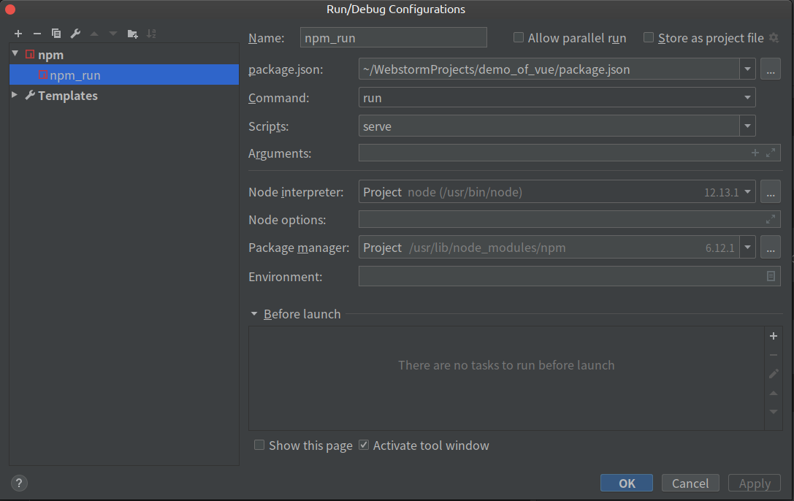

# 学习vue的一些demo
## 创建Vue组件化项目所需环境配置
* Ubuntu20.04从`NodeSource`中安装`Node.js`和`npm`
    * 参考[官方安装教程](https://github.com/nodesource/distributions/blob/master/README.md)
    * NodeSource 是一个公司，聚焦于提供企业级的 Node 支持。它维护了一个 APT 软件源，其中包含了很多 Node.js 版本。如果你的应用需要指定版本的Node.js 版本，使用这个软件源。
    * 以`sudo`用户身份运行下面的命令，下载并执行`NodeSource`安装脚本
        ```bash
        curl -sL https://deb.nodesource.com/setup_12.x | sudo -E bash -
        ```
    * 一旦`NodeSource`源被启用，安装`Node.js`和`npm`
        ```bash
        sudo apt-get install nodejs -y
        ```
    * 验证`Node.js`和`npm`是否正确安装,打印它们的版本号
        ```bash
        node -v
        npm -v
        ```
* 安装`cnpm`淘宝镜像源
    ```bash
    sudo npm install -g cnpm --registry=https://registry.npm.taobao.org
    ```
* 安装`vue-cli`脚手架
    ```bash
    # 建议使用cnpm，速度快
    cnpm install -g @vue/cli
    # 使用npm
    npm install -g @vue/cli
    ```
* 创建`Vue`项目步骤
    * 创建项目
        ```bash
        vue create 项目名
        ```
    * 使用`WebStorm`打开刚创建完成的项目并进行以下配置
        * 点击`Add Configuration`
        * 选择`Add New Configuration`
        * 在弹出的对话框中按照如下配置进行设置
            
## UI组件库Element环境配置
* 安装
    ```bash
    cnpm i element-ui -S
    ```
* `Element`完整引入
    * 在 main.js 中写入以下内容
        ```bash
        import Vue from 'vue';
        import ElementUI from 'element-ui';
        import 'element-ui/lib/theme-chalk/index.css';
        import App from './App.vue';
        
        Vue.use(ElementUI);
        
        new Vue({
          el: '#app',
          render: h => h(App)
        });
        ```
## 安装Vue.js官方的路由管理器Vue Router
```bash
cnpm install vue-router
```
## 安装http请求库axios
```bash
cnpm install axios -s
```
## 运行vue项目
```bash
cnpm install
npm run serve
```